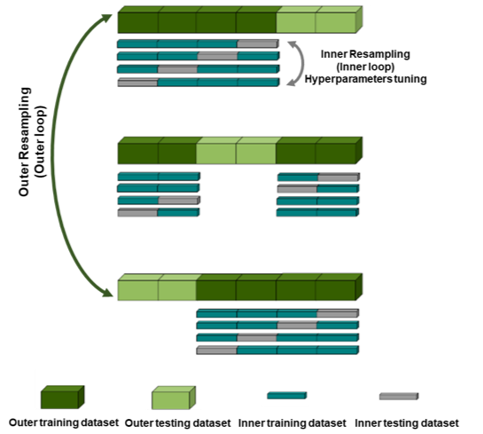

# Face-touching Recognition 
 
In this study, we collected accelerometer data from 10 face touching (FT) and non face touching (NFT) activities performed by 10 participants (3 minutes for each activity per participant). We targeted two problems, 1) recognizing FT and NFT activities. 2) individual activity recognition (IAR) using machine learning. The data is collected through Samsung Gear S3 with a sampling rate of 30Hz. 

## Data Preprocessing
The first 20 and last 5 seconds of the raw accelerometer data were eliminated for each activity. We then splited the raw accelerometer dat into smaller time segments and extracted 49 time- and frequency- domain features.

## Model Training
We examined four machine learning algorithms: 1) logistic regression, 2) support vector machine, 3) decision tree and 4) random forest. For training and testing those models, we used nested crossvalidation (nested-CV) with 10 outer folds and 3 inner folds. The graph and pseudocode of nested crossvalidation are given below.
The final performance of the model was reported by averaging the performance of the outer folds. Accuracy, recall, precision, F1-score and area under the curve (AUC) metrics were used to evaluate the performance of each machine learning method on the binary classification task. Accuracy, macro recall, macro precision, and macro F1-score were used for multiclass classification.

### Nested Crossvalidation

  Overview of nested crossvalidation
  

#### Pseudocode of Nested crossvalidation 
Nested 10-fold Cross-Validation in our study
1.	Define set of hyper-parameter combinations, **C**, for each model.
2.	Divide data into 10 folds (data from each participant will be distributed into each unique fold)
3.	(**outer loop**) For fold i (from 1 to 10) in the 10 folds:
     
    a.	Set data from i-th fold (data from participant i) as test set
     
    b.	Build machine learning models and fine-tune hyperparameters on the remaining 9 folds (data from 9 participants)
     
    c.	For hyperparameter combination c in **C**:
     
    &nbsp;&nbsp;&nbsp;&nbsp;&nbsp;&nbsp;&nbsp;&nbsp;i.	(**inner loop**) Split data from the remaining 9 folds (9 participants) into 3 inner folds (each fold contains data from 3 participants)
     
    &nbsp;&nbsp;&nbsp;&nbsp;&nbsp;&nbsp;&nbsp;&nbsp;&nbsp;&nbsp;&nbsp;&nbsp;&nbsp;&nbsp;&nbsp;&nbsp;1.	Set inner fold j (from 1 to 3) as validation set (validation set contains data from 3 participants)
     
    &nbsp;&nbsp;&nbsp;&nbsp;&nbsp;&nbsp;&nbsp;&nbsp;&nbsp;&nbsp;&nbsp;&nbsp;&nbsp;&nbsp;&nbsp;&nbsp;2.	Train model on the remaining 2 inner folds (training set in the inner loop contains data from 6 participants)
     
    &nbsp;&nbsp;&nbsp;&nbsp;&nbsp;&nbsp;&nbsp;&nbsp;&nbsp;&nbsp;&nbsp;&nbsp;&nbsp;&nbsp;&nbsp;&nbsp;3.	Evaluate model performance on inner fold j
     
    &nbsp;&nbsp;&nbsp;&nbsp;&nbsp;&nbsp;&nbsp;&nbsp;ii.	Calculate average performance over three inner folds for each parameter combination c
     
    d.	Train model on the remaining 9 folds using hyperparameter combination that yielded best average performance over all steps of the inner loop
    e.	Evaluate model performance on outer fold i
4.	Calculate average performance over 10 outer folds

**run_analysis_ft.py** is used to build machine learning models for the FT/NFT recognition task. **run_analysis_iar.py** is used for IAR.

## Requirements 
To run the code:
* python 3.5+
* numpy
* pandas
* sklearn
* os
* matplotlib

